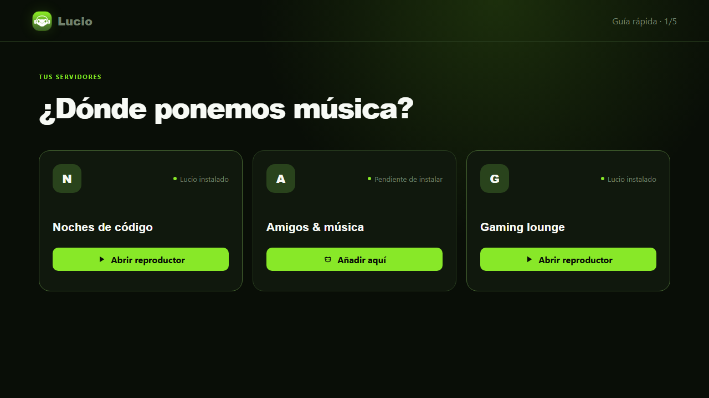
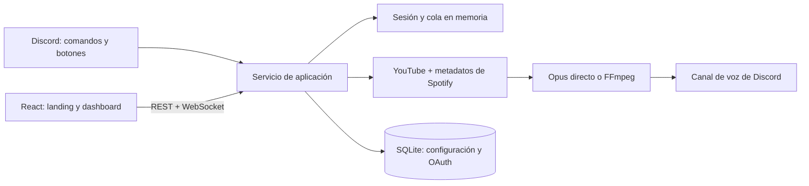

<div align="center">
  
  <h1>Lucio</h1>
  <p><strong>Música ligera, rápida y sincronizada para Discord.</strong></p>
  <p>
    <a href="https://github.com/sebasgrios/lucio-discord/actions/workflows/ci.yml"></a>
    
    
    <a href="LICENSE"></a>
  </p>
  <p>
    <a href="documentation/README.md"><strong>Documentación</strong></a>
    ·
    <a href="CHANGELOG.md"><strong>v1.0.0</strong></a>
    ·
    <a href="SECURITY.md"><strong>Seguridad</strong></a>
  </p>
</div>



Lucio concentra sus recursos en una sola tarea: resolver música, conectarse rápido y reproducir con buena calidad. Puede controlarse mediante comandos y botones de Discord o desde un dashboard web sincronizado en tiempo real.

## Por qué Lucio

| ⚡ Respuesta rápida                                                                       | 🎧 Audio cuidado                                                                                           |
| ----------------------------------------------------------------------------------------- | ---------------------------------------------------------------------------------------------------------- |
| Conecta la voz mientras resuelve la primera pista y prepara la siguiente anticipadamente. | Prioriza WebM Opus compatible con Discord y recodifica a 128 kbps solo cuando es necesario.                |
| **🫶 Control compartido**                                                                 | **🌱 Ligero por diseño**                                                                                   |
| Discord y la web comparten pista, progreso, controles y cola mediante REST y WebSocket.   | Un único servicio, sin audio en el navegador, analítica, publicidad ni funciones ajenas a la reproducción. |

## Fuentes compatibles

| Fuente  | Funciona sin configurar | Compatibilidad                                                                                                                |
| ------- | :---------------------: | ----------------------------------------------------------------------------------------------------------------------------- |
| YouTube |           Sí            | Búsquedas, vídeos y playlists.                                                                                                |
| Spotify |  Para pistas y álbumes  | Pistas, álbumes y playlists propias o colaborativas mediante OAuth por servidor. El audio equivalente se resuelve en YouTube. |

Spotify es opcional. Si un servidor no vincula una cuenta, YouTube continúa disponible. Las playlists públicas ajenas de Spotify no están admitidas por las restricciones actuales de su API.

## Uso rápido

La versión `1.0.0` se distribuye como proyecto autoalojable y no mantiene una instancia pública oficial. Después de completar la [configuración local](#desarrollo-local) o el [despliegue](#despliegue):

1. Abre `/invite` en tu propia instancia y añade Lucio al servidor.
2. Entra en un canal de voz.
3. Ejecuta `/play` con un título o enlace.
4. Usa los botones del panel de Discord o el dashboard web de tu instancia.
5. Opcionalmente, un administrador puede ejecutar `/setup` para vincular Spotify.

### Comandos

| Grupo          | Comandos                                                                 |
| -------------- | ------------------------------------------------------------------------ |
| Reproducción   | `/play`, `/nowplaying`, `/pause`, `/resume`, `/skip`, `/stop`, `/leave`  |
| Cola           | `/queue`, `/remove`, `/move`, `/clear`, `/shuffle`, `/loop`, `/autoplay` |
| Administración | `/setup`, `/settings`                                                    |

Solo quienes están en el canal de voz activo pueden controlar la sesión. El solicitante, los administradores y el rol DJ pueden saltar inmediatamente; el resto de miembros participa mediante votación.

## Arquitectura



El bot, la API, el dashboard y el pipeline de audio viven en un contenedor. SQLite y la caché de `yt-dlp` se conservan en un volumen de Railway; las sesiones musicales son efímeras por diseño.

## Desarrollo local

### Requisitos

- Node.js 24.
- pnpm 11 mediante Corepack.
- FFmpeg.
- `yt-dlp` 2026.08.19.
- Una aplicación de Discord; Spotify solo si se desea probar esa integración.

```bash
git clone git@github.com:sebasgrios/lucio-discord.git
cd lucio-discord
corepack enable
pnpm install --frozen-lockfile
cp .env.example .env
pnpm dev
```

En otra terminal, `pnpm dev:web` abre la interfaz de Vite. En Windows, copia `.env.example` con `Copy-Item .env.example .env`.

Las redirecciones OAuth locales deben coincidir exactamente con `PUBLIC_BASE_URL`:

- Discord: `http://localhost:3000/auth/discord/callback`.
- Spotify: `http://localhost:3000/auth/spotify/callback`.

Consulta todas las variables y el procedimiento de Railway en [Infraestructura y despliegue](documentation/07-infraestructura-y-despliegue.md).

## Verificación

```bash
pnpm verify
pnpm audit
pnpm test:e2e
docker build .
```

El pipeline de CI repite formato, lint, TypeScript estricto, 45 pruebas unitarias, build, pruebas E2E y construcción del contenedor. Las acciones externas y el binario de `yt-dlp` están fijados y verificados criptográficamente.

## Seguridad y privacidad

- OAuth usa estado de un solo uso y cookies `HttpOnly`, `Secure` en producción y `SameSite=Lax`.
- Los refresh tokens de Spotify se cifran con AES-256-GCM antes de guardarse.
- Las URL de medios pasan una política anti-SSRF y los procesos externos no usan comandos interpolados.
- No se registran búsquedas, IP, identificadores de usuario, tokens ni URL firmadas.
- No hay analítica ni cookies publicitarias.

Para comunicar una vulnerabilidad, sigue [SECURITY.md](SECURITY.md). El diseño completo está en [Seguridad y privacidad](documentation/06-seguridad-y-privacidad.md).

## Despliegue

El repositorio no mantiene actualmente un proyecto Railway activo. Puede crearse uno nuevo a partir del [Dockerfile](Dockerfile): debe montar `/data`, sincronizar los comandos globales antes de promover la revisión y comprobar `/health/live`. La plantilla reproducible está en [.railway/railway.ts](.railway/railway.ts).

```bash
railway status
railway up --service lucio-discord --environment production
```

## Documentación

La fuente de verdad funcional y técnica está en [documentation/README.md](documentation/README.md). Los cambios publicados se resumen en [CHANGELOG.md](CHANGELOG.md).

## Licencia

Lucio se distribuye bajo la [licencia MIT](LICENSE). Los servicios y contenidos de Discord, Spotify y YouTube conservan sus propias condiciones de uso.
